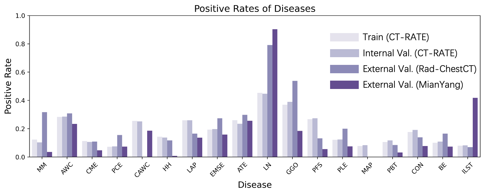

# EXACT: EXplainable Abnormality-aware ChesT CT Foundation Model

---

## Table of Contents

- [About](#about)
- [Method Overview](#method-overview)
- [Code Structure](#code-structure)
- [Dataset](#dataset)
- [Environment Setup](#environment-setup)
- [Training](#training)
- [Inference](#inference)
- [Experimental Results](#experimental-results)
- [Visualization](#visualization)
- [Citation](#citation)

---

## About

**EXACT** (**EX**plainable **A**bnormality-aware **C**hes**T** CT Foundation Model) is a 3D chest CT foundation model that unifies multi-disease diagnosis, lesion localization, segmentation, and radiology report generation in a single framework.

EXACT extends our previous work **Chest-OMDL** (MIDL 2025) by introducing:
- **Y-Mamba**: a dual-branch 3D state-space model that jointly encodes CT volumes and organ-prior maps, producing 18-channel voxel-level **Anomaly-aware Maps (AAmap)**.
- **Multi-Instance Learning (MIL)**: weakly supervised pre-training driven purely by image-level disease labels automatically extracted from radiology reports.
- **EXACT-CHAT**: a CT-specific vision-language model (based on LLaVA + LLaMA-3.1-8B) that takes AAmap embeddings as visual tokens and generates structured radiology reports.

Unlike CLIP-based models that produce only global embeddings, EXACT provides voxel-level explainability for both classification and localization, with no per-disease annotation required.

---

## Method Overview


*Fig. 1 | Overview of EXACT. (a) Pre-training pipeline: CT volumes and radiology reports are jointly used to train the Y-Mamba backbone with MIL supervision, producing 18-channel voxel-level Anomaly-aware Maps (AAmap). (b–g) Downstream tasks and performance summary: multi-disease zero-shot diagnosis, supervised fine-tuning, zero-shot and supervised anomaly localization, and CT report generation via EXACT-CHAT.*


*Fig. 2 | Multi-disease diagnosis performance of EXACT. AUROC, F1 Score, and Accuracy on CT-RATE (internal), RAD-ChestCT (external), and MianYang (external) datasets under zero-shot and supervised fine-tuning settings, compared with state-of-the-art methods.*


*Fig. 4 | Anomaly localization results. DSC and AUPR on ReX, COVID-19, and MosMed datasets under zero-shot and supervised fine-tuning settings.*


*Fig. 5 | Overview and detailed evaluation of EXACT-CHAT. Architecture of EXACT-CHAT (top): a frozen image encoder and a frozen AAmap encoder supply visual tokens to LLaMA-3.1-8B-Instruct via an attentional pooling projector; disease diagnosis text is used as structured prompts. Report generation examples (bottom): comparison of EXACT-CHAT (w/o Prior), EXACT-CHAT, and EXACT-CHAT (Refined) against the reference report.*

---

## Code Structure

```
EXACT/
├── EXACT_Pretrain/              # Stage 1 – Weakly supervised foundation model pre-training
│   ├── train.py                 # Main training entry
│   ├── engine.py                # Training / evaluation loops
│   ├── utils.py                 # Shared utilities
│   ├── configs/
│   │   └── config_setting.py    # All hyperparameters and paths
│   ├── datasets/
│   │   └── dataset.py           # Dataset & dataloader
│   └── models/
│       └── ymamba/
│           └── ymamba.py        # Y-Mamba model definition
│
├── EXACT_ClassFinetune/         # Stage 2 – Supervised disease classification fine-tuning
│   ├── train_heatmap.py         # Training entry (AAmap → lightweight classifier)
│   ├── engine.py / engine18.py  # Training loops (16- and 18-class variants)
│   ├── configs/
│   ├── datasets/
│   └── models/
│
├── EXACT-Seg/                   # Stage 3 – Anomaly localization & segmentation
│   ├── zero_shot_seg/           # Zero-shot segmentation from AAmap thresholding
│   │   ├── overlay_heatmap.py   # Aggregate disease-specific heatmaps
│   │   └── threshold_overlay.py # Threshold to binary segmentation masks
│   └── supervised_seg/          # Supervised segmentation fine-tuning
│       └── train_supervised.py
│
├── EXACT-CHAT/                  # Stage 4 – CT report generation (vision-language model)
│   ├── llava/                   # Core LLaVA package (CT-adapted)
│   │   ├── model/
│   │   │   ├── multimodal_encoder/
│   │   │   │   └── ct_clip.py           # CT-CLIP visual encoder
│   │   │   ├── multimodal_projector/
│   │   │   │   ├── builder.py           # attn_pool + MLP projector
│   │   │   │   └── coca_attentional_pooler.py
│   │   │   └── language_model/
│   │   │       └── llava_llama.py       # LLaMA-3.1 backbone
│   │   ├── train/
│   │   │   ├── train.py                 # Training logic (CT data loading)
│   │   │   ├── train_mem.py             # DeepSpeed entry point
│   │   │   └── llava_trainer.py
│   │   └── serve/                       # Inference & Gradio demo server
│   ├── scripts/
│   │   ├── pretrain.sh                  # Stage 4a – Projector pre-training
│   │   └── finetune_lora.sh             # Stage 4b – LoRA instruction fine-tuning
│   ├── evaluations/
│   │   ├── evaluate_llm.py              # LLM-based clinical accuracy scoring
│   │   ├── multi_metrics.py             # BLEU / METEOR / ROUGE / CIDEr by question type
│   │   └── new_llm_metrics.py           # Multiple-choice accuracy
│   ├── utils/                           # Data preparation & format-conversion scripts
│   ├── zero2.json                       # DeepSpeed ZeRO-2 config
│   └── zero3.json                       # DeepSpeed ZeRO-3 config
│
└── README.md
```

---

## Dataset

### Overview

| Split | Source | # Volumes |
|-------|--------|-----------|
| Training | CT-RATE (in-distribution) | ~50,000 |
| Validation (in-dist.) | CT-RATE held-out | ~3,500 |
| Test (in-dist.) | CT-RATE held-out | ~3,500 |
| Test (out-of-dist.) | RAD-ChestCT / MianYang external | ~500 |



*Extended Data Fig. 3 | Disease distribution. Positive rates of 18 diseases across training set (CT-RATE), internal validation (CT-RATE), and two external validation sets (RAD-ChestCT, MianYang).*

### Data Sources

- **CT-RATE** (primary): [https://huggingface.co/datasets/ibrahimhamamci/CT-RATE](https://huggingface.co/datasets/ibrahimhamamci/CT-RATE)
  - 3D chest CT volumes with paired free-text radiology reports.
  - Disease labels are automatically extracted from reports using an LLM.

### Dataset Splits

- Training / Validation / Test split follows the official CT-RATE partitioning.
- Out-of-distribution test sets (RadChest, Mianyang) use no re-training; evaluation is zero-shot.

### Data Preprocessing

**For in-distribution data:**
```bash
python EXACT_Pretrain/data_preprocessed/data_preprocessed.py
```

**For out-of-distribution / external data (two steps):**
```bash
# Step 1: basic preprocessing
python EXACT_Pretrain/data_preprocessed/new_data_preprocessed.py

# Step 2: orientation alignment with the training set
python EXACT_Pretrain/data_preprocessed/flip_data.py
```

---

## Environment Setup

EXACT has **two separate environments** due to conflicting dependency requirements between the foundation model (Mamba-SSM) and the language model (DeepSpeed + PEFT).

---

### Environment 1 – Foundation Model (Pre-training, Classification, Segmentation)

Used for `EXACT_Pretrain`, `EXACT_ClassFinetune`, and `EXACT-Seg`.

**Base image**: `pytorch/pytorch:2.4.1-cuda12.1-cudnn9-devel`

```bash
conda create -n exact python=3.10
conda activate exact

# PyTorch with CUDA 12.1
pip install torch==2.4.1 torchvision==0.19.1 torchaudio==2.4.1 \
    --index-url https://download.pytorch.org/whl/cu121

# Core dependencies
pip install \
    numpy==2.1.2 \
    scipy==1.14.1 \
    nibabel==5.3.2 \
    SimpleITK==2.4.0 \
    medmnist==3.0.2 \
    MedPy==0.5.2 \
    opencv-python==4.10.0.84 \
    scikit-learn==1.5.2 \
    scikit-image==0.24.0 \
    pandas==2.2.3 \
    einops==0.8.0 \
    tqdm==4.66.5 \
    pillow==11.0.0 \
    torchio==0.20.1 \
    joblib==1.4.2 \
    monai==1.3.0 \
    tensorboardX==2.6.2.2 \
    itk==5.4.4.post1

# mamba-ssm requires compilation; must be installed AFTER PyTorch
pip install --no-build-isolation mamba-ssm==2.2.4
```

> **Note:** If you encounter `ModuleNotFoundError` at runtime, install the missing package manually with `pip install <package_name>`.

---

### Environment 2 – Report Generation (EXACT-CHAT)

Used for `EXACT-CHAT` only.

**Base image**: `pytorch/pytorch:2.4.1-cuda12.1-cudnn9-devel`

```bash
conda create -n exact-chat python=3.10
conda activate exact-chat

# PyTorch with CUDA 12.1
pip install torch==2.4.1 torchvision==0.19.1 torchaudio==2.4.1 \
    --index-url https://download.pytorch.org/whl/cu121

# LLM / training dependencies
pip install \
    transformers==4.47.0 \
    accelerate==1.6.0 \
    tokenizers==0.21.0 \
    sentencepiece==0.2.0 \
    safetensors==0.4.5 \
    peft==0.15.2 \
    bitsandbytes==0.43.0 \
    deepspeed==0.16.7 \
    huggingface-hub==0.25.2 \
    einops==0.8.0 \
    einops-exts

# Medical imaging dependencies (shared with Env 1)
pip install \
    nibabel==5.3.2 \
    SimpleITK==2.4.0 \
    monai \
    torchio \
    opencv-python-headless \
    joblib

# Install the llava package from the repo root
cd EXACT-CHAT
pip install -e .
```

---

## Training

### Stage 1 – Foundation Model Pre-training (`EXACT_Pretrain`)

Edit `EXACT_Pretrain/configs/config_setting.py` to set your data paths, GPU IDs, batch size, etc.

```bash
conda activate exact
cd EXACT_Pretrain

python train.py
```

Key hyperparameters (in `configs/config_setting.py`):

| Parameter | Default | Description |
|-----------|---------|-------------|
| `train_data_path` | — | Path to preprocessed training volumes |
| `gpu_id` | `[0,1,2,3]` | GPU indices |
| `batch_size` | 4 | Per-GPU batch size |
| `num_workers` | 8 | DataLoader workers |
| `epochs` | 200 | Total pre-training epochs |
| `lr` | 1e-4 | Initial learning rate |
| `work_dir` | — | Output directory for checkpoints & logs |

Checkpoints are saved under `<work_dir>/checkpoints/`. The best checkpoint is `best.pth`.

---

### Stage 2 – Disease Classification Fine-tuning (`EXACT_ClassFinetune`)

The EXACT backbone is **frozen**; only a lightweight classifier head is trained on top of the generated AAmaps.

```bash
conda activate exact
cd EXACT_ClassFinetune

python train_heatmap.py
```

---

### Stage 3a – Zero-shot Segmentation (`EXACT-Seg/zero_shot_seg`)

No training required. Directly apply the pre-trained AAmaps.

```bash
conda activate exact
cd EXACT-Seg/zero_shot_seg

# Step 1: aggregate disease-specific heatmaps
python overlay_heatmap.py \
  --input-root /path/to/work_dir/test_results/prediction_heatmaps/epoch_x \
  --output-dir /path/to/overlaid_heatmaps \
  --res high-res \
  --diseases "Atelectasis,Lung opacity,Consolidation" \
  --aggregate mean

# Step 2: threshold to binary segmentation masks
python threshold_overlay.py \
  --in-overlay /path/to/overlaid_heatmaps \
  --out-seg /path/to/segmentation_results \
  --thresh-mode both \
  --binary-threshold 0.004 \
  --ratio 0.1 \
  --overwrite
```

---

### Stage 3b – Supervised Segmentation Fine-tuning (`EXACT-Seg/supervised_seg`)

```bash
conda activate exact
cd EXACT-Seg/supervised_seg

python train_supervised.py --task train
```

Recommended checkpoint: `<work_dir>/checkpoints/best.pth`

---

### Stage 4a – EXACT-CHAT Projector Pre-training

Pre-trains the cross-modal projector (attentional pooler + MLP) while keeping both the visual encoder and LLM frozen.

```bash
conda activate exact-chat
cd EXACT-CHAT

bash scripts/pretrain.sh
```

Key arguments in `scripts/pretrain.sh`:

```bash
deepspeed --master_port 12438 llava/train/train_mem.py \
    --deepspeed ./zero3.json \
    --model_name_or_path meta-llama/Meta-Llama-3.1-8B-Instruct \
    --version plain \
    --data_path /path/to/pretrain_data.json \
    --image_folder /path/to/pretrain_image_folder/ \
    --vision_tower openai/clip-vit-large-patch14-336 \
    --mm_projector_type attn_pool+mlp2x_gelu \
    --tune_mm_mlp_adapter True \
    --mm_vision_select_layer -2 \
    --bf16 True \
    --output_dir ./checkpoints/llava-llama3.1_8B-pretrain \
    --num_train_epochs 1 \
    --per_device_train_batch_size 12 \
    --learning_rate 1e-3 \
    --model_max_length 4096
```

---

### Stage 4b – EXACT-CHAT LoRA Instruction Fine-tuning

Fine-tunes the LLM with LoRA while unfreezing the projector.

```bash
conda activate exact-chat
cd EXACT-CHAT

bash scripts/finetune_lora.sh
```

Key arguments in `scripts/finetune_lora.sh`:

```bash
deepspeed --master_port 12600 llava/train/train_mem.py \
    --deepspeed ./zero3.json \
    --lora_enable True --lora_r 128 --lora_alpha 256 \
    --model_name_or_path meta-llama/Meta-Llama-3.1-8B-Instruct \
    --version llama3_1 \
    --data_path /path/to/train_vqa.json \
    --image_folder /path/to/ct_embeddings/ \
    --vision_tower openai/clip-vit-large-patch14-336 \
    --mm_projector_type "attn_pool+mlp2x_gelu" \
    --pretrain_mm_mlp_adapter ./checkpoints/llava-llama3.1_8B-pretrain/mm_projector.bin \
    --bf16 True \
    --output_dir ./checkpoints/llava-llama3.1_8B-finetune-lora \
    --num_train_epochs 10 \
    --per_device_train_batch_size 2 \
    --learning_rate 2e-5 \
    --model_max_length 128000 \
    --mm_projector_lr 2e-5
```

| LoRA Parameter | Value |
|---------------|-------|
| `lora_r` | 128 |
| `lora_alpha` | 256 |
| `lora_dropout` | 0.05 |
| Target modules | q/k/v/o/gate/up/down proj |

---

## Inference

### Multi-disease Diagnosis (Zero-shot)

```bash
conda activate exact
cd EXACT_Pretrain

python test.py \
    --resume_model /path/to/checkpoints/best.pth \
    --test_data_path /path/to/test_data
```

### Multi-disease Diagnosis (Supervised)

```bash
conda activate exact
cd EXACT_ClassFinetune

python test.py \
    --resume_model /path/to/classfinetune/checkpoints/best.pth \
    --test_data_path /path/to/test_data
```

### Zero-shot Segmentation

(See Stage 3a training section above – the same two-step pipeline is used for inference.)

### Supervised Segmentation

```bash
conda activate exact
cd EXACT-Seg/supervised_seg

python train_supervised.py \
    --task test \
    --resume_model /path/to/seg/checkpoints/best.pth
```

### Report Generation (EXACT-CHAT)

**Step 1 – Merge LoRA weights into the base model:**

```bash
conda activate exact-chat
cd EXACT-CHAT

python llava/serve/save_merged_model.py \
    --base_model meta-llama/Meta-Llama-3.1-8B-Instruct \
    --lora_model ./checkpoints/llava-llama3.1_8B-finetune-lora/checkpoint-XXXXX \
    --output_dir ./checkpoints/merged_model
```

**Step 2 – Single-sample inference example:**

```python
import torch
from llava.model.builder import load_pretrained_model
from llava.mm_utils import tokenizer_image_token
from llava.constants import IMAGE_TOKEN_INDEX, DEFAULT_IMAGE_TOKEN

# Load model
tokenizer, model, image_processor, _ = load_pretrained_model(
    model_path="./checkpoints/merged_model",
    model_base=None,
    model_name="llava_llama"
)

# Load CT embedding (pre-computed AAmap embedding, shape [N, D])
import torch
ct_embedding = torch.load("/path/to/sample_embedding.pt").unsqueeze(0).cuda()

# Build prompt
prompt = f"{DEFAULT_IMAGE_TOKEN}\n<report_generation>Generate a structured radiology report for this chest CT."
input_ids = tokenizer_image_token(prompt, tokenizer, IMAGE_TOKEN_INDEX, return_tensors="pt").unsqueeze(0).cuda()

# Generate
with torch.inference_mode():
    output_ids = model.generate(
        input_ids,
        images=ct_embedding,
        do_sample=False,
        temperature=0,
        max_new_tokens=1024,
    )
report = tokenizer.decode(output_ids[0], skip_special_tokens=True)
print(report)
```

**Step 3 – Multi-GPU batch validation:**

```bash
python llava/serve/ctchat_validation_llama_multigpu.py \
    --model_path ./checkpoints/merged_model \
    --data_path /path/to/valid_vqa.json \
    --image_folder /path/to/ct_embeddings/ \
    --output_file ./output_validation.json
```

### Evaluation

```bash
conda activate exact-chat
cd EXACT-CHAT

# BLEU / METEOR / ROUGE-L / CIDEr (per question type)
python evaluations/multi_metrics.py \
    /path/to/valid_vqa_ground_truth.json \
    ./output_validation.json

# LLM-based clinical accuracy scoring (requires LLaMA-3.1-70B)
python evaluations/evaluate_llm.py \
    ./output_validation.json \
    /path/to/valid_vqa_ground_truth.json \
    ./llm_scores.json
```

---

## Experimental Results

### Multi-disease Classification

**Supplementary Table 4** | Comparison of multi-disease diagnosis performance. Metrics include AUROC, F1 Score, and Accuracy (mean [95% CI] where available). **Red** = best, *blue* = second best, **bold** = third best per column.

#### Internal Validation — CT-RATE Dataset (n = 1,564)

| Models | AUROC | F1 Score | Accuracy | P-value |
|--------|-------|----------|----------|---------|
| CT-Net (Fine-tuning) | 0.629 | 0.657 | 0.617 | AUROC: 0.001; F1: n.s.; Acc: n.s. |
| CT-CLIP (Zero-shot) | 0.731 | 0.707 | 0.668 | |
| CT-CLIP (VocabFine) | 0.756 | 0.738 | 0.705 | |
| CT-CLIP (ClassFine) | 0.756 | 0.724 | 0.689 | |
| fVLM (Zero-shot) | 0.778 | 0.751 | 0.718 | |
| MedVista3D (Zero-shot) | 0.782 | 0.770 | 0.745 | |
| Merlin (Zero-shot) | 0.595 [0.584, 0.606] | 0.687 [0.674, 0.702] | 0.585 [0.573, 0.601] | |
| T3D (Zero-shot) | 0.737 | 0.725 | 0.690 | |
| T3D (Fine-tuning) | 0.802 | 0.778 | 0.763 | |
| RadZero3D (Zero-shot) | 0.762 | 0.742 | 0.701 | |
| BIUD (Zero-shot) | 0.713 | 0.716 | 0.681 | |
| **EXACT (Zero-shot)** | **0.830 [0.823, 0.837]** | **0.836 [0.826, 0.844]** | **0.768 [0.758, 0.778]** | |
| **EXACT (Fine-tuning)** | **0.833 [0.826, 0.840]** | **0.836 [0.829, 0.844]** | **0.769 [0.761, 0.780]** | |

#### External Validation — RAD-ChestCT Dataset (n = 3,630)

| Models | AUROC | F1 Score | Accuracy | P-value |
|--------|-------|----------|----------|---------|
| CT-Net (Fine-tuning) | 0.544 | 0.564 | 0.517 | AUROC: 0.022; F1: < 0.001; Acc: < 0.001 |
| CT-CLIP (Zero-shot) | 0.629 | 0.637 | 0.592 | |
| CT-CLIP (VocabFine) | 0.650 | 0.677 | 0.636 | |
| CT-CLIP (ClassFine) | 0.643 | 0.644 | 0.599 | |
| fVLM (Zero-shot) | 0.644 | 0.663 | 0.619 | |
| MedVista3D (Zero-shot) | 0.710 | 0.681 | 0.668 | |
| Merlin (Zero-shot) | 0.603 [0.595, 0.610] | 0.657 [0.646, 0.670] | 0.598 [0.584, 0.608] | |
| BIUD (Zero-shot) | 0.629 | 0.652 | 0.606 | |
| **EXACT (Zero-shot)** | **0.728 [0.722, 0.734]** | **0.731 [0.728, 0.746]** | **0.677 [0.668, 0.704]** | |
| **EXACT (Fine-tuning)** | **0.734 [0.728, 0.740]** | **0.737 [0.729, 0.744]** | **0.682 [0.670, 0.686]** | |

#### External Validation — MianYang Dataset (n = 500)

| Models | AUROC | F1 Score | Accuracy | P-value |
|--------|-------|----------|----------|---------|
| CT-Net (Fine-tuning) | 0.612 [0.580, 0.645] | 0.618 [0.599, 0.653] | 0.603 [0.572, 0.674] | AUROC: 0.005; F1: < 0.001; Acc: < 0.001 |
| CT-CLIP (Zero-shot) | 0.689 [0.666, 0.709] | 0.746 [0.729, 0.771] | 0.679 [0.657, 0.708] | |
| CT-CLIP (VocabFine) | 0.712 [0.687, 0.736] | 0.766 [0.746, 0.788] | 0.695 [0.675, 0.730] | |
| CT-CLIP (ClassFine) | 0.704 [0.679, 0.729] | 0.757 [0.737, 0.787] | 0.694 [0.667, 0.731] | |
| fVLM (Zero-shot) | 0.716 [0.696, 0.736] | 0.748 [0.725, 0.772] | 0.699 [0.672, 0.730] | |
| Merlin (Zero-shot) | 0.602 [0.575, 0.629] | 0.695 [0.657, 0.731] | 0.610 [0.573, 0.658] | |
| **EXACT (Zero-shot)** | **0.758 [0.737, 0.779]** | **0.773 [0.738, 0.807]** | **0.734 [0.699, 0.776]** | |
| **EXACT (Fine-tuning)** | **0.769 [0.749, 0.788]** | **0.805 [0.780, 0.824]** | **0.761 [0.728, 0.788]** | |

---

### Anomaly Localization & Segmentation

**Supplementary Table 5** | Comparison of anomaly localization performance under zero-shot and supervised fine-tuning settings. DSC = Dice similarity coefficient; HIT = Hit Rate at threshold; AUPR = Area Under the Precision-Recall curve.

#### Task: Zero-shot Anomaly Localization

| Dataset | Models | DSC | HIT 5% | HIT 10% | AUPR | HIT 5% | HIT 10% | p-value |
|---------|--------|-----|--------|---------|------|--------|---------|---------|
| ReX-Train (n=1102) | BiomedParse-v2 | 0.012 [0.001, 0.014] | 0.152 | 0.090 | 0.026 [0.024, 0.029] | 0.132 | 0.065 | Dice: < 0.001; AUPR: < 0.001 |
| | fVLM | 0.006 [0.005, 0.007] | 0.030 | 0.010 | 0.004 [0.003, 0.004] | 0.011 | 0.002 | |
| | CT-CLIP | 0.004 [0.004, 0.005] | 0.000 | 0.000 | 0.002 [0.002, 0.002] | 0.004 | 0.000 | |
| | **EXACT** | **0.050 [0.045, 0.055]** | **0.290** | **0.193** | **0.044 [0.039, 0.049]** | **0.231** | **0.153** | |
| ReX-Val (n=157) | BiomedParse-v2 | 0.065 [0.051, 0.079] | 0.357 | 0.247 | 0.028 [0.022, 0.033] | 0.377 | 0.223 | Dice: 0.016; AUPR: < 0.001 |
| | fVLM | 0.025 [0.019, 0.031] | 0.141 | 0.054 | 0.024 [0.019, 0.031] | 0.150 | 0.060 | |
| | CT-CLIP | 0.005 [0.004, 0.006] | 0.003 | 0.000 | 0.002 [0.002, 0.002] | 0.000 | 0.000 | |
| | **EXACT** | **0.071 [0.056, 0.086]** | **0.389** | **0.268** | **0.065 [0.051, 0.079]** | **0.395** | **0.242** | |
| COVID-19 (n=20) | BiomedParse-v2 | 0.340 [0.185, 0.490] | 0.550 | 0.500 | 0.459 [0.303, 0.632] | 0.900 | 0.750 | Dice: n.s.; AUPR: n.s. |
| | fVLM | 0.081 [0.041, 0.121] | 0.500 | 0.300 | 0.059 [0.035, 0.087] | 0.450 | 0.200 | |
| | CT-CLIP | 0.023 [0.010, 0.035] | 0.000 | 0.000 | 0.010 [0.005, 0.016] | 0.000 | 0.000 | |
| | **EXACT** | **0.435 [0.348, 0.526]** | **0.950** | **0.850** | **0.530 [0.440, 0.609]** | **0.950** | **0.900** | |
| MosMed (n=50) | BiomedParse-v2 | 0.254 [0.196, 0.315] | 0.840 | 0.660 | 0.258 [0.201, 0.321] | 0.820 | 0.600 | Dice: < 0.001; AUPR: 0.002 |
| | fVLM | 0.016 [0.012, 0.020] | 0.060 | 0.000 | 0.007 [0.006, 0.009] | 0.039 | 0.000 | |
| | CT-CLIP | 0.004 [0.003, 0.005] | 0.000 | 0.000 | 0.002 [0.001, 0.003] | 0.000 | 0.000 | |
| | **EXACT** | **0.363 [0.318, 0.404]** | **0.960** | **0.900** | **0.330 [0.283, 0.376]** | **0.960** | **0.920** | |

#### Task: Anomaly Localization with Supervised Fine-tuning

| Dataset | Models | DSC | HIT 5% | HIT 10% | AUPR | HIT 5% | HIT 10% | p-value |
|---------|--------|-----|--------|---------|------|--------|---------|---------|
| ReX-Val (n=157) | RWKV-Unet | 0.112 [0.089, 0.135] | 0.312 | 0.242 | 0.180 [0.145, 0.219] | 0.580 | 0.465 | Dice: 0.028; AUPR: 0.007 |
| | SegMamba | 0.198 [0.165, 0.230] | 0.556 | 0.494 | 0.187 [0.154, 0.223] | 0.556 | 0.494 | |
| | **EXACT-Seg** | **0.215 [0.182, 0.249]** | **0.643** | **0.580** | **0.200 [0.165, 0.238]** | **0.592** | **0.478** | |
| COVID-19 (n=16) | RWKV-Unet | 0.305 [0.205, 0.412] | 0.812 | 0.812 | 0.404 [0.292, 0.513] | 0.875 | 0.812 | Dice: < 0.001; AUPR: 0.006 |
| | SegMamba | 0.332 [0.221, 0.450] | 0.812 | 0.750 | 0.358 [0.235, 0.493] | 0.750 | 0.750 | |
| | **EXACT-Seg** | **0.476 [0.332, 0.621]** | **0.875** | **0.875** | **0.529 [0.374, 0.679]** | **0.875** | **0.875** | |
| MosMed (n=40) | RWKV-Unet | 0.348 [0.290, 0.405] | 0.950 | 0.875 | 0.373 [0.311, 0.438] | 0.950 | 0.850 | Dice: < 0.001; AUPR: < 0.001 |
| | SegMamba | 0.352 [0.252, 0.378] | 0.850 | 0.850 | 0.324 [0.255, 0.393] | 0.825 | 0.800 | |
| | **EXACT-Seg** | **0.454 [0.387, 0.520]** | **0.950** | **0.875** | **0.463 [0.393, 0.536]** | **0.925** | **0.900** | |

---

### Report Generation

**Supplementary Table 6** | Comparison of report generation performance. Metrics include BLEU-1, METEOR, CIDEr, ROUGE-L, and clinical efficacy scores (RadBERT-F1, RadBERT-Precision, RadBERT-Recall).

#### Internal Validation — CT-RATE Dataset (n = 1,564)

| Models | BLEU-1 | METEOR | CIDEr | ROUGE-L | RadBERT-F1 | RadBERT-Prec | RadBERT-Rec | P-value |
|--------|--------|--------|-------|---------|-----------|--------------|-------------|---------|
| RadFM | 0.442 | 0.399 | N/A | 0.315 | 0.059 | 0.170 | 0.038 | < 0.001 |
| CT2Rep | 0.444 | 0.402 | N/A | 0.310 | 0.160 | 0.435 | 0.128 | |
| M3D | 0.436 | 0.400 | N/A | 0.326 | 0.148 | 0.407 | 0.090 | |
| CT-CHAT (LLaMA 3.1 70B) | 0.395 | 0.219 | 0.221 | 0.321 | 0.184 | 0.450 | 0.158 | |
| CT-CHAT (w/ nodule attrs) | N/A | N/A | N/A | N/A | 0.305 | 0.382 | 0.268 | |
| MedVista3D | 0.474 | 0.252 | 0.349 | 0.386 | N/A | N/A | N/A | |
| Reg2RG | 0.473 | 0.441 | N/A | 0.367 | 0.253 | 0.423 | 0.181 | |
| T3D | 0.501 | N/A | N/A | 0.378 | 0.274 | 0.355 | 0.207 | |
| CT-GRAPH | 0.485 | 0.421 | N/A | 0.313 | 0.296 | 0.386 | 0.248 | |
| BTB3D | 0.439 | 0.223 | N/A | N/A | 0.258 | 0.260 | 0.260 | |
| **EXACT-CHAT** | **0.444 [0.435, 0.453]** | **0.228 [0.223, 0.232]** | **0.139 [0.109, 0.177]** | **0.296 [0.288, 0.304]** | **0.310 [0.274, 0.347]** | **0.410 [0.292, 0.541]** | **0.371 [0.336, 0.408]** | |
| **EXACT-CHAT (Refined)** | **0.465 [0.459, 0.471]** | **0.237 [0.234, 0.241]** | **0.077 [0.059, 0.097]** | **0.288 [0.281, 0.296]** | **0.501 [0.457, 0.543]** | **0.414 [0.368, 0.460]** | **0.730 [0.677, 0.780]** | |

#### External Validation — RAD-ChestCT Dataset (n = 3,630)

| Models | BLEU-1 | METEOR | CIDEr | ROUGE-L | RadBERT-F1 | RadBERT-Prec | RadBERT-Rec | P-value |
|--------|--------|--------|-------|---------|-----------|--------------|-------------|---------|
| RadFM | N/A | N/A | N/A | N/A | 0.069 | 0.283 | 0.044 | < 0.001 |
| CT2Rep | N/A | N/A | N/A | N/A | 0.133 | 0.299 | 0.139 | |
| M3D | N/A | N/A | N/A | N/A | 0.113 [0.091, 0.137] | 0.269 [0.213, 0.329] | 0.080 [0.064, 0.097] | |
| CT-CHAT (LLaMA 3.1 70B) | N/A | N/A | N/A | N/A | 0.182 | 0.382 | 0.171 | |
| Merlin | N/A | N/A | N/A | N/A | 0.182 | 0.271 | 0.149 | |
| BTB3D | N/A | N/A | N/A | N/A | 0.266 | 0.272 | 0.329 | |
| Reg2RG | N/A | N/A | N/A | N/A | 0.113 [0.093, 0.134] | 0.277 [0.205, 0.354] | 0.082 [0.068, 0.098] | |
| Hulu-Med | N/A | N/A | N/A | N/A | 0.279 [0.249, 0.309] | 0.398 [0.355, 0.441] | 0.254 [0.226, 0.283] | |
| **EXACT-CHAT** | N/A | N/A | N/A | N/A | **0.289 [0.265, 0.313]** | **0.469 [0.328, 0.546]** | **0.298 [0.275, 0.321]** | |
| **EXACT-CHAT (Refined)** | N/A | N/A | N/A | N/A | **0.441 [0.416, 0.467]** | **0.406 [0.380, 0.433]** | **0.610 [0.576, 0.642]** | |

#### External Validation — MianYang Dataset (n = 500)

| Models | BLEU-1 | METEOR | CIDEr | ROUGE-L | RadBERT-F1 | RadBERT-Prec | RadBERT-Rec | P-value |
|--------|--------|--------|-------|---------|-----------|--------------|-------------|---------|
| RadFM | 0.000 [0.000, 0.000] | 0.008 [0.008, 0.009] | 0.000 [0.000, 0.000] | 0.019 [0.018, 0.020] | 0.023 [0.009, 0.043] | 0.143 [0.052, 0.188] | 0.046 [0.020, 0.076] | < 0.001 |
| M3D | 0.000 [0.000, 0.000] | 0.024 [0.023, 0.026] | 0.000 [0.000, 0.000] | 0.051 [0.049, 0.053] | 0.068 [0.027, 0.118] | 0.162 [0.063, 0.293] | 0.055 [0.019, 0.102] | |
| CT-CHAT (LLaMA 3.1 70B) | 0.259 [0.249, 0.268] | 0.184 [0.181, 0.188] | 0.003 [0.001, 0.005] | 0.259 [0.255, 0.264] | 0.073 [0.045, 0.103] | 0.119 [0.086, 0.151] | 0.088 [0.053, 0.128] | |
| Merlin | 0.000 [0.000, 0.000] | 0.023 [0.022, 0.023] | 0.000 [0.000, 0.000] | 0.052 [0.051, 0.053] | 0.024 [0.021, 0.028] | 0.074 [0.013, 0.076] | 0.059 [0.057, 0.060] | |
| Reg2RG | 0.249 [0.239, 0.259] | 0.161 [0.158, 0.164] | 0.006 [0.003, 0.008] | 0.184 [0.182, 0.187] | 0.086 [0.041, 0.145] | 0.169 [0.077, 0.294] | 0.066 [0.029, 0.118] | |
| Hulu-Med | 0.134 [0.119, 0.150] | 0.111 [0.106, 0.117] | 0.003 [0.001, 0.005] | 0.155 [0.148, 0.162] | 0.175 [0.095, 0.265] | 0.265 [0.135, 0.425] | 0.176 [0.080, 0.289] | |
| **EXACT-CHAT** | **0.402 [0.393, 0.411]** | **0.214 [0.210, 0.217]** | **0.012 [0.009, 0.017]** | **0.266 [0.262, 0.269]** | **0.290 [0.221, 0.358]** | **0.326 [0.221, 0.436]** | **0.367 [0.307, 0.430]** | |
| **EXACT-CHAT (Refined)** | **0.446 [0.438, 0.453]** | **0.227 [0.224, 0.231]** | **0.022 [0.016, 0.028]** | **0.275 [0.272, 0.278]** | **0.410 [0.320, 0.498]** | **0.338 [0.259, 0.422]** | **0.667 [0.546, 0.784]** | |

---

## Visualization


*Extended Data Fig. 2 | Visual grounding of reports generated by EXACT-CHAT (CT-RATE dataset). Each example shows the generated report (left), the corresponding AAmap anomaly score bar chart (middle), and the voxel-level heatmap overlay on the CT slice (right). Key pathologies mentioned in the report are anatomically highlighted in the AAmap, demonstrating the model's spatial explainability.*

---

## Citation

EXACT extends the following published work. If you find this project useful, please cite:

**Base Paper (MIDL 2025):**

```bibtex
@inproceedings{bai2025chestomdl,
  title     = {Chest-{OMDL}: Organ-specific Multidisease Detection and Localization
               in Chest Computed Tomography using Weakly Supervised Deep Learning
               from Free-text Radiology Report},
  author    = {Xuguang Bai and Mingxuan Liu and Yifei Chen and
               Hongjia Yang and Qiyuan Tian},
  booktitle = {Medical Imaging with Deep Learning},
  year      = {2025},
  url       = {https://openreview.net/forum?id=ns6nq592HX}
}
```

**EXACT (citation will be updated upon publication):**

```bibtex
@article{bai2025exact,
  title   = {EXACT: EXplainable Abnormality-aware ChesT CT Foundation Model},
  author  = {Xuguang Bai and Mingxuan Liu and ...},
  journal = {--},
  year    = {2025}
}
```
