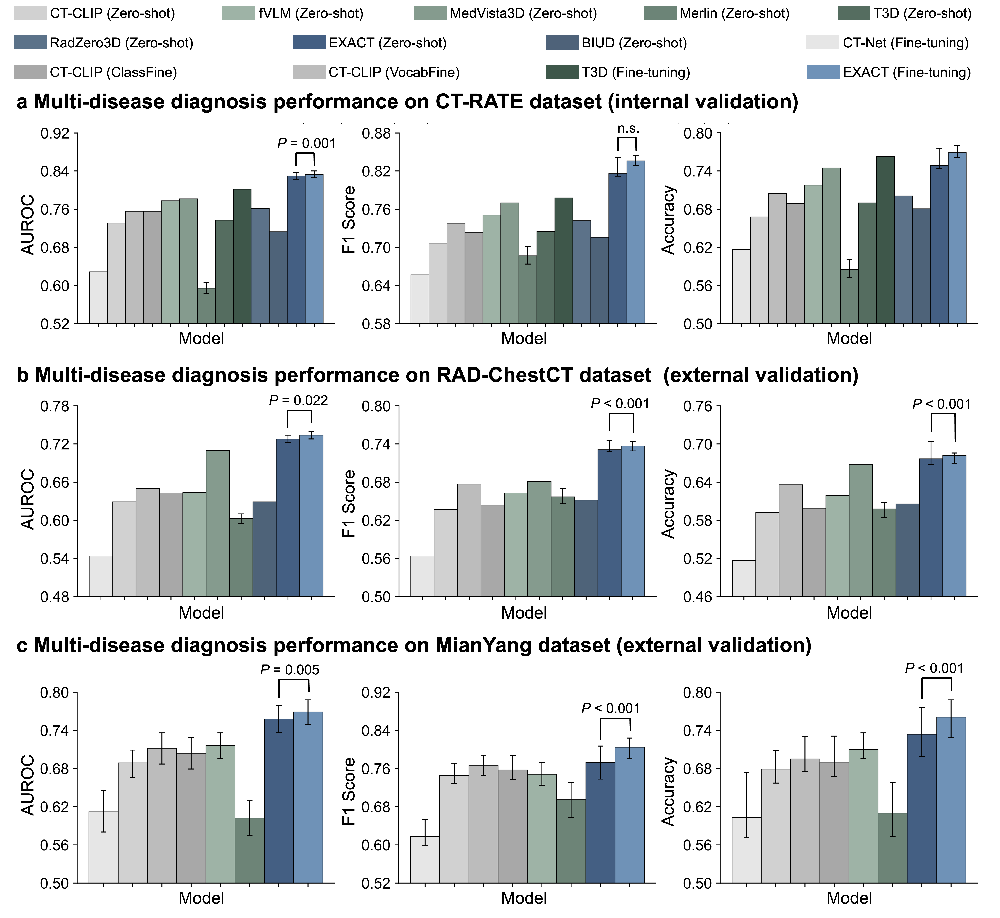
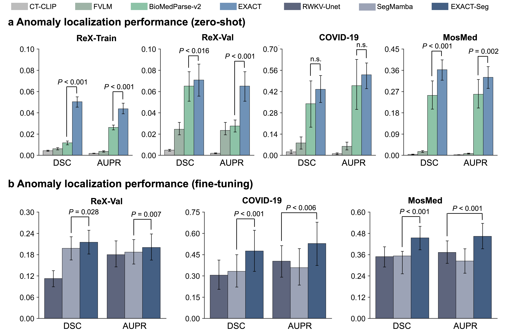
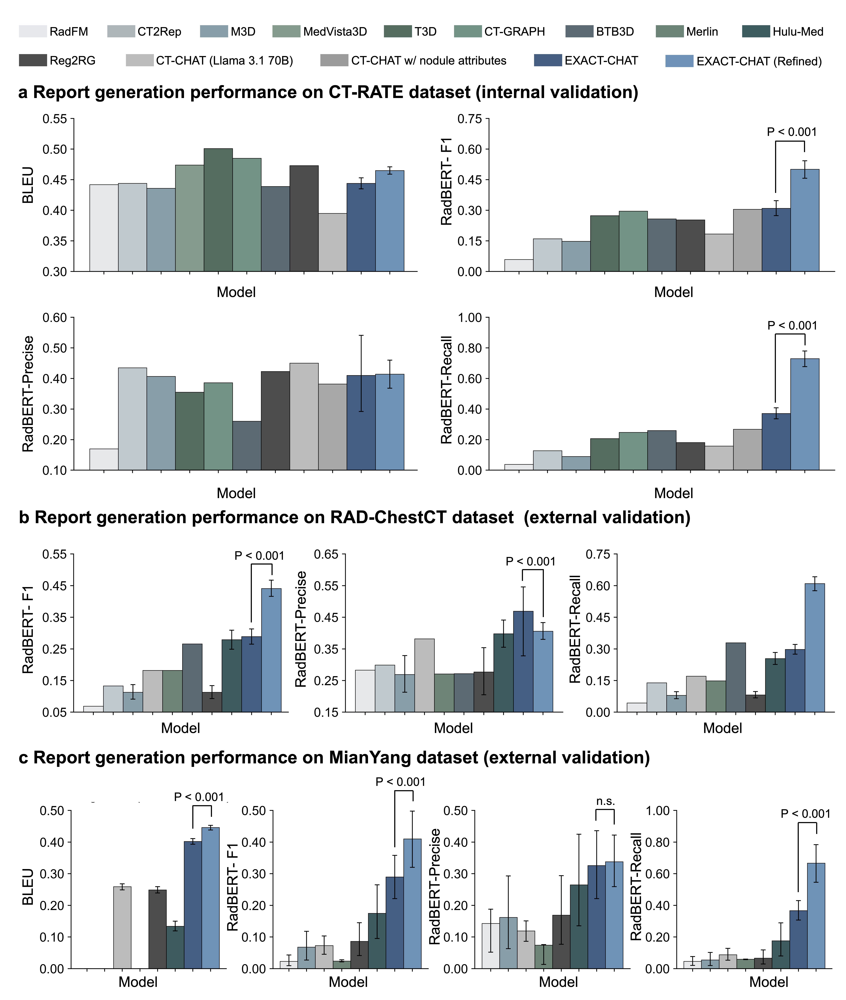

# EXACT: EXplainable Abnormality-aware ChesT CT Foundation Model

---

## Table of Contents

- [About](#about)
- [Method Overview](#method-overview)
- [Code Structure](#code-structure)
- [Dataset](#dataset)
- [Environment Setup](#environment-setup)
- [Training](#training)
- [Inference](#inference)
- [Experimental Results](#experimental-results)
- [Visualization](#visualization)
- [Citation](#citation)

---

## About

**EXACT** (**EX**plainable **A**bnormality-aware **C**hes**T** CT Foundation Model) is a 3D chest CT foundation model that unifies multi-disease diagnosis, lesion localization, segmentation, and radiology report generation in a single framework.

EXACT extends our previous work **Chest-OMDL** (MIDL 2025) by introducing:
- **Y-Mamba**: a dual-branch 3D state-space model that jointly encodes CT volumes and organ-prior maps, producing 18-channel voxel-level **Anomaly-aware Maps (AAmap)**.
- **Multi-Instance Learning (MIL)**: weakly supervised pre-training driven purely by image-level disease labels automatically extracted from radiology reports.
- **EXACT-CHAT**: a CT-specific vision-language model (based on LLaVA + LLaMA-3.1-8B) that takes AAmap embeddings as visual tokens and generates structured radiology reports.

Unlike CLIP-based models that produce only global embeddings, EXACT provides voxel-level explainability for both classification and localization, with no per-disease annotation required.

---

## Method Overview


*Figure 1. Overview of the EXACT framework. (a) Pre-training pipeline: CT volumes and radiology reports are jointly used to train the Y-Mamba backbone with MIL supervision, producing 18-channel voxel-level Anomaly-aware Maps (AAmap). (b-g) Downstream tasks: multi-disease zero-shot diagnosis, supervised fine-tuning, zero-shot and supervised segmentation, and CT report generation via EXACT-CHAT.*

### Y-Mamba Architecture


*Figure 2. Detailed architecture of Y-Mamba: (a) dual-decoder U-Net with shared image encoder feeding both an organ segmentation decoder and an anomaly detection decoder; (b) Gated Spatial Convolution (GSC) block; (c) MambaLayer with 1D selective state-space model.*

### EXACT-CHAT Architecture


*Figure 3. EXACT-CHAT architecture and report generation examples. A frozen CLIP-based image encoder and a frozen AAmap encoder supply visual tokens to LLaMA-3.1-8B-Instruct via an attentional pooling projector. Disease diagnosis text serves as structured prompts to guide report generation. An optional GPT-4.1 refinement step further improves clinical accuracy.*

---

## Code Structure

```
EXACT/
├── EXACT_Pretrain/              # Stage 1 – Weakly supervised foundation model pre-training
│   ├── train.py                 # Main training entry
│   ├── engine.py                # Training / evaluation loops
│   ├── utils.py                 # Shared utilities
│   ├── configs/
│   │   └── config_setting.py    # All hyperparameters and paths
│   ├── datasets/
│   │   └── dataset.py           # Dataset & dataloader
│   └── models/
│       └── ymamba/
│           └── ymamba.py        # Y-Mamba model definition
│
├── EXACT_ClassFinetune/         # Stage 2 – Supervised disease classification fine-tuning
│   ├── train_heatmap.py         # Training entry (AAmap → lightweight classifier)
│   ├── engine.py / engine18.py  # Training loops (16- and 18-class variants)
│   ├── configs/
│   ├── datasets/
│   └── models/
│
├── EXACT-Seg/                   # Stage 3 – Anomaly localization & segmentation
│   ├── zero_shot_seg/           # Zero-shot segmentation from AAmap thresholding
│   │   ├── overlay_heatmap.py   # Aggregate disease-specific heatmaps
│   │   └── threshold_overlay.py # Threshold to binary segmentation masks
│   └── supervised_seg/          # Supervised segmentation fine-tuning
│       └── train_supervised.py
│
├── EXACT-CHAT/                  # Stage 4 – CT report generation (vision-language model)
│   ├── llava/                   # Core LLaVA package (CT-adapted)
│   │   ├── model/
│   │   │   ├── multimodal_encoder/
│   │   │   │   └── ct_clip.py           # CT-CLIP visual encoder
│   │   │   ├── multimodal_projector/
│   │   │   │   ├── builder.py           # attn_pool + MLP projector
│   │   │   │   └── coca_attentional_pooler.py
│   │   │   └── language_model/
│   │   │       └── llava_llama.py       # LLaMA-3.1 backbone
│   │   ├── train/
│   │   │   ├── train.py                 # Training logic (CT data loading)
│   │   │   ├── train_mem.py             # DeepSpeed entry point
│   │   │   └── llava_trainer.py
│   │   └── serve/                       # Inference & Gradio demo server
│   ├── scripts/
│   │   ├── pretrain.sh                  # Stage 4a – Projector pre-training
│   │   └── finetune_lora.sh             # Stage 4b – LoRA instruction fine-tuning
│   ├── evaluations/
│   │   ├── evaluate_llm.py              # LLM-based clinical accuracy scoring
│   │   ├── multi_metrics.py             # BLEU / METEOR / ROUGE / CIDEr by question type
│   │   └── new_llm_metrics.py           # Multiple-choice accuracy
│   ├── utils/                           # Data preparation & format-conversion scripts
│   ├── zero2.json                       # DeepSpeed ZeRO-2 config
│   └── zero3.json                       # DeepSpeed ZeRO-3 config
│
└── README.md
```

---

## Dataset

### Overview

| Split | Source | # Volumes |
|-------|--------|-----------|
| Training | CT-RATE (in-distribution) | ~50,000 |
| Validation (in-dist.) | CT-RATE held-out | ~3,500 |
| Test (in-dist.) | CT-RATE held-out | ~3,500 |
| Test (out-of-dist.) | RAD-ChestCT / MianYang external | ~500 |


*Figure 4. Positive rates of 18 diseases across training set (CT-RATE), internal validation (CT-RATE), and two external validation sets (RAD-ChestCT, MianYang).*

### Data Sources

- **CT-RATE** (primary): [https://huggingface.co/datasets/ibrahimhamamci/CT-RATE](https://huggingface.co/datasets/ibrahimhamamci/CT-RATE)
  - 3D chest CT volumes with paired free-text radiology reports.
  - Disease labels are automatically extracted from reports using an LLM.

### Dataset Splits

- Training / Validation / Test split follows the official CT-RATE partitioning.
- Out-of-distribution test sets (RadChest, Mianyang) use no re-training; evaluation is zero-shot.

### Data Preprocessing

**For in-distribution data:**
```bash
python EXACT_Pretrain/data_preprocessed/data_preprocessed.py
```

**For out-of-distribution / external data (two steps):**
```bash
# Step 1: basic preprocessing
python EXACT_Pretrain/data_preprocessed/new_data_preprocessed.py

# Step 2: orientation alignment with the training set
python EXACT_Pretrain/data_preprocessed/flip_data.py
```

---

## Environment Setup

EXACT has **two separate environments** due to conflicting dependency requirements between the foundation model (Mamba-SSM) and the language model (DeepSpeed + PEFT).

---

### Environment 1 – Foundation Model (Pre-training, Classification, Segmentation)

Used for `EXACT_Pretrain`, `EXACT_ClassFinetune`, and `EXACT-Seg`.

**Base image**: `pytorch/pytorch:2.4.1-cuda12.1-cudnn9-devel`

```bash
conda create -n exact python=3.10
conda activate exact

# PyTorch with CUDA 12.1
pip install torch==2.4.1 torchvision==0.19.1 torchaudio==2.4.1 \
    --index-url https://download.pytorch.org/whl/cu121

# Core dependencies
pip install \
    numpy==2.1.2 \
    scipy==1.14.1 \
    nibabel==5.3.2 \
    SimpleITK==2.4.0 \
    medmnist==3.0.2 \
    MedPy==0.5.2 \
    opencv-python==4.10.0.84 \
    scikit-learn==1.5.2 \
    scikit-image==0.24.0 \
    pandas==2.2.3 \
    einops==0.8.0 \
    tqdm==4.66.5 \
    pillow==11.0.0 \
    torchio==0.20.1 \
    joblib==1.4.2 \
    monai==1.3.0 \
    tensorboardX==2.6.2.2 \
    itk==5.4.4.post1

# mamba-ssm requires compilation; must be installed AFTER PyTorch
pip install --no-build-isolation mamba-ssm==2.2.4
```

> **Note:** If you encounter `ModuleNotFoundError` at runtime, install the missing package manually with `pip install <package_name>`.

---

### Environment 2 – Report Generation (EXACT-CHAT)

Used for `EXACT-CHAT` only.

**Base image**: `pytorch/pytorch:2.4.1-cuda12.1-cudnn9-devel`

```bash
conda create -n exact-chat python=3.10
conda activate exact-chat

# PyTorch with CUDA 12.1
pip install torch==2.4.1 torchvision==0.19.1 torchaudio==2.4.1 \
    --index-url https://download.pytorch.org/whl/cu121

# LLM / training dependencies
pip install \
    transformers==4.47.0 \
    accelerate==1.6.0 \
    tokenizers==0.21.0 \
    sentencepiece==0.2.0 \
    safetensors==0.4.5 \
    peft==0.15.2 \
    bitsandbytes==0.43.0 \
    deepspeed==0.16.7 \
    huggingface-hub==0.25.2 \
    einops==0.8.0 \
    einops-exts

# Medical imaging dependencies (shared with Env 1)
pip install \
    nibabel==5.3.2 \
    SimpleITK==2.4.0 \
    monai \
    torchio \
    opencv-python-headless \
    joblib

# Install the llava package from the repo root
cd EXACT-CHAT
pip install -e .
```

---

## Training

### Stage 1 – Foundation Model Pre-training (`EXACT_Pretrain`)

Edit `EXACT_Pretrain/configs/config_setting.py` to set your data paths, GPU IDs, batch size, etc.

```bash
conda activate exact
cd EXACT_Pretrain

python train.py
```

Key hyperparameters (in `configs/config_setting.py`):

| Parameter | Default | Description |
|-----------|---------|-------------|
| `train_data_path` | — | Path to preprocessed training volumes |
| `gpu_id` | `[0,1,2,3]` | GPU indices |
| `batch_size` | 4 | Per-GPU batch size |
| `num_workers` | 8 | DataLoader workers |
| `epochs` | 200 | Total pre-training epochs |
| `lr` | 1e-4 | Initial learning rate |
| `work_dir` | — | Output directory for checkpoints & logs |

Checkpoints are saved under `<work_dir>/checkpoints/`. The best checkpoint is `best.pth`.

---

### Stage 2 – Disease Classification Fine-tuning (`EXACT_ClassFinetune`)

The EXACT backbone is **frozen**; only a lightweight classifier head is trained on top of the generated AAmaps.

```bash
conda activate exact
cd EXACT_ClassFinetune

python train_heatmap.py
```

---

### Stage 3a – Zero-shot Segmentation (`EXACT-Seg/zero_shot_seg`)

No training required. Directly apply the pre-trained AAmaps.

```bash
conda activate exact
cd EXACT-Seg/zero_shot_seg

# Step 1: aggregate disease-specific heatmaps
python overlay_heatmap.py \
  --input-root /path/to/work_dir/test_results/prediction_heatmaps/epoch_x \
  --output-dir /path/to/overlaid_heatmaps \
  --res high-res \
  --diseases "Atelectasis,Lung opacity,Consolidation" \
  --aggregate mean

# Step 2: threshold to binary segmentation masks
python threshold_overlay.py \
  --in-overlay /path/to/overlaid_heatmaps \
  --out-seg /path/to/segmentation_results \
  --thresh-mode both \
  --binary-threshold 0.004 \
  --ratio 0.1 \
  --overwrite
```

---

### Stage 3b – Supervised Segmentation Fine-tuning (`EXACT-Seg/supervised_seg`)

```bash
conda activate exact
cd EXACT-Seg/supervised_seg

python train_supervised.py --task train
```

Recommended checkpoint: `<work_dir>/checkpoints/best.pth`

---

### Stage 4a – EXACT-CHAT Projector Pre-training

Pre-trains the cross-modal projector (attentional pooler + MLP) while keeping both the visual encoder and LLM frozen.

```bash
conda activate exact-chat
cd EXACT-CHAT

bash scripts/pretrain.sh
```

Key arguments in `scripts/pretrain.sh`:

```bash
deepspeed --master_port 12438 llava/train/train_mem.py \
    --deepspeed ./zero3.json \
    --model_name_or_path meta-llama/Meta-Llama-3.1-8B-Instruct \
    --version plain \
    --data_path /path/to/pretrain_data.json \
    --image_folder /path/to/pretrain_image_folder/ \
    --vision_tower openai/clip-vit-large-patch14-336 \
    --mm_projector_type attn_pool+mlp2x_gelu \
    --tune_mm_mlp_adapter True \
    --mm_vision_select_layer -2 \
    --bf16 True \
    --output_dir ./checkpoints/llava-llama3.1_8B-pretrain \
    --num_train_epochs 1 \
    --per_device_train_batch_size 12 \
    --learning_rate 1e-3 \
    --model_max_length 4096
```

---

### Stage 4b – EXACT-CHAT LoRA Instruction Fine-tuning

Fine-tunes the LLM with LoRA while unfreezing the projector.

```bash
conda activate exact-chat
cd EXACT-CHAT

bash scripts/finetune_lora.sh
```

Key arguments in `scripts/finetune_lora.sh`:

```bash
deepspeed --master_port 12600 llava/train/train_mem.py \
    --deepspeed ./zero3.json \
    --lora_enable True --lora_r 128 --lora_alpha 256 \
    --model_name_or_path meta-llama/Meta-Llama-3.1-8B-Instruct \
    --version llama3_1 \
    --data_path /path/to/train_vqa.json \
    --image_folder /path/to/ct_embeddings/ \
    --vision_tower openai/clip-vit-large-patch14-336 \
    --mm_projector_type "attn_pool+mlp2x_gelu" \
    --pretrain_mm_mlp_adapter ./checkpoints/llava-llama3.1_8B-pretrain/mm_projector.bin \
    --bf16 True \
    --output_dir ./checkpoints/llava-llama3.1_8B-finetune-lora \
    --num_train_epochs 10 \
    --per_device_train_batch_size 2 \
    --learning_rate 2e-5 \
    --model_max_length 128000 \
    --mm_projector_lr 2e-5
```

| LoRA Parameter | Value |
|---------------|-------|
| `lora_r` | 128 |
| `lora_alpha` | 256 |
| `lora_dropout` | 0.05 |
| Target modules | q/k/v/o/gate/up/down proj |

---

## Inference

### Multi-disease Diagnosis (Zero-shot)

```bash
conda activate exact
cd EXACT_Pretrain

python test.py \
    --resume_model /path/to/checkpoints/best.pth \
    --test_data_path /path/to/test_data
```

### Multi-disease Diagnosis (Supervised)

```bash
conda activate exact
cd EXACT_ClassFinetune

python test.py \
    --resume_model /path/to/classfinetune/checkpoints/best.pth \
    --test_data_path /path/to/test_data
```

### Zero-shot Segmentation

(See Stage 3a training section above – the same two-step pipeline is used for inference.)

### Supervised Segmentation

```bash
conda activate exact
cd EXACT-Seg/supervised_seg

python train_supervised.py \
    --task test \
    --resume_model /path/to/seg/checkpoints/best.pth
```

### Report Generation (EXACT-CHAT)

**Step 1 – Merge LoRA weights into the base model:**

```bash
conda activate exact-chat
cd EXACT-CHAT

python llava/serve/save_merged_model.py \
    --base_model meta-llama/Meta-Llama-3.1-8B-Instruct \
    --lora_model ./checkpoints/llava-llama3.1_8B-finetune-lora/checkpoint-XXXXX \
    --output_dir ./checkpoints/merged_model
```

**Step 2 – Single-sample inference example:**

```python
import torch
from llava.model.builder import load_pretrained_model
from llava.mm_utils import tokenizer_image_token
from llava.constants import IMAGE_TOKEN_INDEX, DEFAULT_IMAGE_TOKEN

# Load model
tokenizer, model, image_processor, _ = load_pretrained_model(
    model_path="./checkpoints/merged_model",
    model_base=None,
    model_name="llava_llama"
)

# Load CT embedding (pre-computed AAmap embedding, shape [N, D])
import torch
ct_embedding = torch.load("/path/to/sample_embedding.pt").unsqueeze(0).cuda()

# Build prompt
prompt = f"{DEFAULT_IMAGE_TOKEN}\n<report_generation>Generate a structured radiology report for this chest CT."
input_ids = tokenizer_image_token(prompt, tokenizer, IMAGE_TOKEN_INDEX, return_tensors="pt").unsqueeze(0).cuda()

# Generate
with torch.inference_mode():
    output_ids = model.generate(
        input_ids,
        images=ct_embedding,
        do_sample=False,
        temperature=0,
        max_new_tokens=1024,
    )
report = tokenizer.decode(output_ids[0], skip_special_tokens=True)
print(report)
```

**Step 3 – Multi-GPU batch validation:**

```bash
python llava/serve/ctchat_validation_llama_multigpu.py \
    --model_path ./checkpoints/merged_model \
    --data_path /path/to/valid_vqa.json \
    --image_folder /path/to/ct_embeddings/ \
    --output_file ./output_validation.json
```

### Evaluation

```bash
conda activate exact-chat
cd EXACT-CHAT

# BLEU / METEOR / ROUGE-L / CIDEr (per question type)
python evaluations/multi_metrics.py \
    /path/to/valid_vqa_ground_truth.json \
    ./output_validation.json

# LLM-based clinical accuracy scoring (requires LLaMA-3.1-70B)
python evaluations/evaluate_llm.py \
    ./output_validation.json \
    /path/to/valid_vqa_ground_truth.json \
    ./llm_scores.json
```

---

## Experimental Results

### Multi-disease Classification



*Figure 5. Multi-disease diagnosis performance (AUROC / F1 / Accuracy) on (a) CT-RATE internal validation, (b) RAD-ChestCT external validation, and (c) MianYang external validation. EXACT (zero-shot and fine-tuning) achieves state-of-the-art performance against CT-CLIP, fVLM, MedVista3D, Merlin, T3D, RadZero3D, BIUD, and CT-Net.*


*Figure 6. Per-disease ROC curves for all 18 diseases under zero-shot (top) and fine-tuning (bottom) settings across CT-RATE, RAD-ChestCT, and MianYang datasets.*

### Anomaly Localization & Segmentation



*Figure 7. Anomaly localization performance (DSC / AUPR) on ReX, COVID-19, and MosMed datasets under (a) zero-shot and (b) supervised fine-tuning settings.*

### Report Generation



*Figure 8. Report generation performance on (a) CT-RATE internal validation, (b) RAD-ChestCT external validation, and (c) MianYang external validation. Metrics include BLEU, RadBERT-F1, RadBERT-Precision, and RadBERT-Recall. EXACT-CHAT (Refined) achieves the best RadBERT recall across all datasets.*

---

## Visualization

### Anomaly Localization Heatmaps


*Figure 9. Qualitative comparison of anomaly localization. (b) Zero-shot localization: EXACT-AAmap vs. CT-CLIP, fVLM, and BiomedParse-v2 across COVID-19, RexGrounding, MosMed datasets. (d) Supervised segmentation: EXACT-Seg vs. RWKV-UNet and SegMamba.*

### EXACT-CHAT Report Generation with Grounding


*Figure 10. EXACT-CHAT report generation examples with explainability. Each sample shows the generated report (left), the corresponding AAmap anomaly score bar chart (middle), and the voxel-level heatmap overlay on the CT slice (right). Key pathologies mentioned in the report are anatomically grounded to the highlighted regions in the AAmap.*

---

## Citation

EXACT extends the following published work. If you find this project useful, please cite:

**Base Paper (MIDL 2025):**

```bibtex
@inproceedings{bai2025chestomdl,
  title     = {Chest-{OMDL}: Organ-specific Multidisease Detection and Localization
               in Chest Computed Tomography using Weakly Supervised Deep Learning
               from Free-text Radiology Report},
  author    = {Xuguang Bai and Mingxuan Liu and Yifei Chen and
               Hongjia Yang and Qiyuan Tian},
  booktitle = {Medical Imaging with Deep Learning},
  year      = {2025},
  url       = {https://openreview.net/forum?id=ns6nq592HX}
}
```

**EXACT (citation will be updated upon publication):**

```bibtex
@article{bai2025exact,
  title   = {EXACT: EXplainable Abnormality-aware ChesT CT Foundation Model},
  author  = {Xuguang Bai and Mingxuan Liu and ...},
  journal = {--},
  year    = {2025}
}
```
